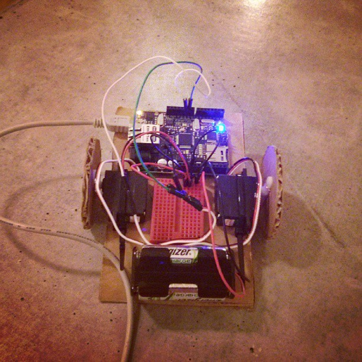

# SimpleBot.

## Overview

This is one of the most simple robots you can make. Features are:

* quick to put together (about an hour)
* very hackable (it can be built with cardboard or laser cut so very easily modifiable)
* can move pretty fast (at full tilt it will go about half a metre a second - faster with more juice for the servos!)
* very extendable (much of the magic happens in code and sensors can be easily fed in)
* Cheap (costs about $100 which is very cheap for your first robot)

This bot is an adaptation of the excellent [SumoBot Jr](https://github.com/makenai/sumobot-jr/) made by [Paweł Szymczykowski](http://twitter.com/makenai) but doesn't require laser cutting wood or plastic though you can if you want something a bit more long lasting.

## Capabilities

This is a tethered robot, meaning it stays connected to your computer via a USB cable. This means you can get your computer to do all the hard work to provide interface control (say a web page or an app) and processing (computer vision if you attached a webcam for example!).

This is the very first prototype, put together in about 30 minutes one evening.

Once done you can reuse all of the components to make a bigger, badder, faster robot and switch the cardboard for more durable elements such as laser cut wood or plastic if you desire. We've even supplied the SVG and DXF files to do exactly that.

## Materials needed

### Suppliers

All of the links here are for [LittleBird Electronics](http://littlebirdelectronics.com) for the robot. There are other electronics retailers in Australia however LBE has been a big part of the maker community over the last few years, they carry a big range of components and they have excellent customer service.

[JayCar](http://www.jaycar.com.au) provide a range of basic components but not the full range. Mostly good for basics like wire and tools.

[Freetronics](http://www.freetronics.com) are a local Melbourne hardware design business. They produce some of the highest quality electronics in the world and they do it all Open Source. They even build satellites! If you're [just after an arduino](http://www.freetronics.com/collections/arduino/products/eleven#.UjuVQxIW3S0) and not the whole bot then support not just an Aussie business doing high tech but a Melbourne one too.

* [Arduino](http://littlebirdelectronics.com/products/eleven-100-arduino-uno-compatible) $42.85 - This is the "brains" of your robot and it comes with a USB cable.
* [4xAA Battery holder](http://littlebirdelectronics.com/products/battery-holder-4xaa-cube) $2.74 - Provides power for your motors. You'll also want 4xAA batteries. We'd recommend rechargables and we'll have some chargers on the day.
* [Mini Breadboard](http://littlebirdelectronics.com/products/breadboard-mini-self-adhesive-yellow) $3.63 - This allows you to wire things together easily. There are other colours if you don't like Yellow.
* [2x Continuous Rotation Servos](http://littlebirdelectronics.com/products/servo-medium-full-rotation) $15.35 x 2 - These drive the wheels. *Don't forget you need to get two of these.*
* [Jumper wire](http://littlebirdelectronics.com/products/jumper-wires-standard-7-m-m-pack-of-30) $6.05 - Wires to connect everything together. You won't need all of these but they are handy to have when you want to extend your bot.

Total price: $85.97

We'll have cardboard, cable ties and other prototyping stuff available on NBD to help build your very own bot but other things you might want to bring could include:

* Laser pointer to make an annoying cat toy.
* Stickers to bling out your bot.
* Spikes to take out others Ben Hur or Mad Max style.
* USB WebCam if you want to give your bot some vision.
* USB cable extender if you want some range.

# SETUP

To setup your SimpleBot we're assuming you have Arduino and NodeJS installed already. If you're using a LeoStick arduino follow these notes. If not, skip to "flashing my arduino" below.

## Set up your LeoStick

You'll need to get your Arduino IDE to be able to talk to your leostick. In this folder there is a file called boards.txt - copy the content of this file into the bottom of your arduino boards.txt file. Ask or google this before you do it.

Restart your arduino IDE and you should now see LeoStick v1.0 and LeoStick v2.0 in your lists of boards. Choose V2.0 to start as that's most likely what you have.

Try and upload blink to your LeoStick and make sure it all works.

If that works you're good to move on.

## Flashing my arduino

Load up the simplebot/SimpleBotFirmata sketch.

Compile and upload it to your arduino.

Wire up your SimpleBot and then you have an examples folder with ping.js and simplebot.js which you can use as a base for everything else.

# Driving over Bluetooth

You can use bluetooth to drive the simplebot but it's not for the faint of heart. Get a bluetooth module and configire it like you do on [this wiki entry in J5](https://github.com/rwaldron/johnny-five/wiki/JY-MCU-Bluetooth-Serial-Port-Module-Notes). This is a mandatory.

Also note that this *will* work with a leostick but you get a lot of timing errors so be patient, or switch to an Uno or something.

Once you've got your bluetooth set up, you should see it in your serial ports.

Simply go:

    node examples/simplebot.js /dev/tty.SERIALPORT

Changing the path at the end to whatever yours is. You should now be able to drive using wireless over bluetooth. 

If you get errors about pinMode and undefined issues that's basically a timing issue or a dropped backet over bluetooth. Told you this wasn't for the faint of heart. Try again and see what happens.

If you happen to have a playstation controller then you can use the sb-controller.js example to drive your simplebot using a console controller which is pretty cool.

# Driving using wifi

You can use a simple serial wifi module to make your SimpleBot work over wireless (increased range, no BT headaches). Check out [this gist for more details](https://gist.github.com/ajfisher/1fdbcbbf96b7f2ba73cd).
